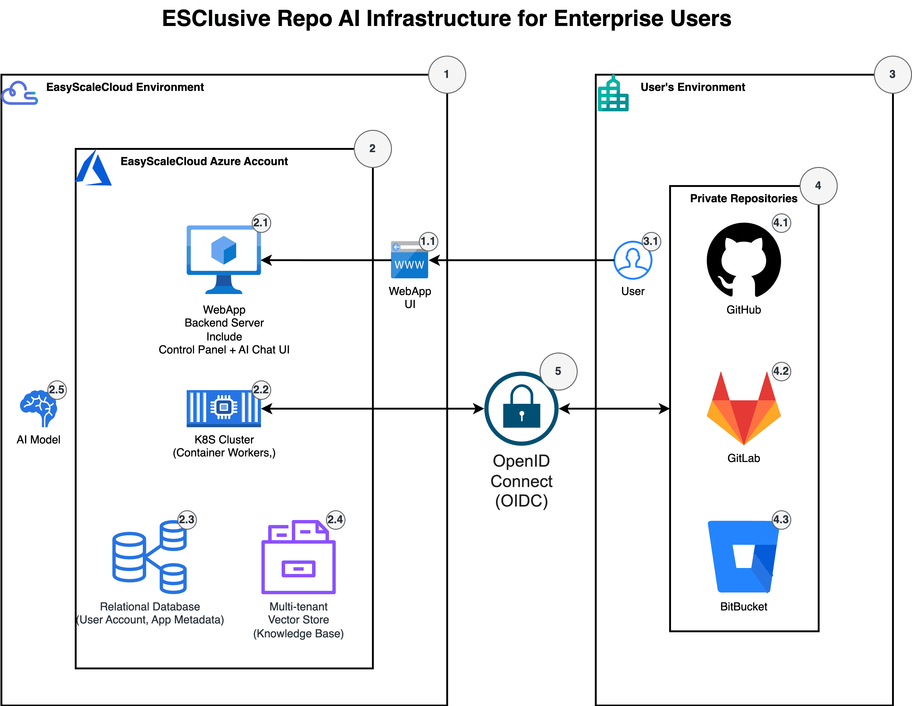

ESClusive Repo AI Infrastructure for Enterprise Users
==============================================================================
ESClusive Repo AI provides secure, scalable infrastructure that connects to your private Git repositories while maintaining complete data isolation and security.

**Five Core Components**:

1. EasyScaleCloud (ESC) Environment: Houses the primary infrastructure components
2. Microsoft Azure Foundation: Leverages Azure's enterprise-grade services for reliability and scale
3. User Environment: Interfaces seamlessly with your existing systems
4. Git Repository Integration: Connects to your preferred Git hosting service
5. Secure Authentication: Utilizes OpenID Connect (OIDC) to establish secure connections between ESC systems and your private repositories

**System Design Walkthrough**

- **1.1 Web Application UI**: The intuitive frontend interface where users manage accounts, configure repository connections, and interact with the AI assistant through a streamlined chat interface.
- **2.1 Backend Server**: Processes user requests, manages authentication, and coordinates between all system components while enforcing security policies.
- **2.2 Kubernetes Cluster**: Orchestrates containerized workers that continuously synchronize knowledge bases from connected Git repositories, ensuring your AI assistant always has the latest codebase information.
- **2.3 Relational Database**: Stores essential metadata including user accounts, subscription plans, application settings, repository configurations, and knowledge base indexing information.
- **2.4 Multi-tenant Vector Store**: Securely houses knowledge base data with complete tenant isolation, optimized for high-performance AI retrieval operations.
- **2.5 AI Model Integration**: Connects to cost-efficient large language models that power the inference engine, delivering accurate and context-aware responses about your repositories.
- **3.1 User Authentication**: Provides secure login protocols for accessing the ESClusive Repo AI platform while maintaining your organization's security standards.
- **4.1-4.3 Git Provider Flexibility**: Seamlessly integrates with GitHub, GitLab, BitBucket, or any other Git hosting service your team prefers, with no vendor lock-in.
